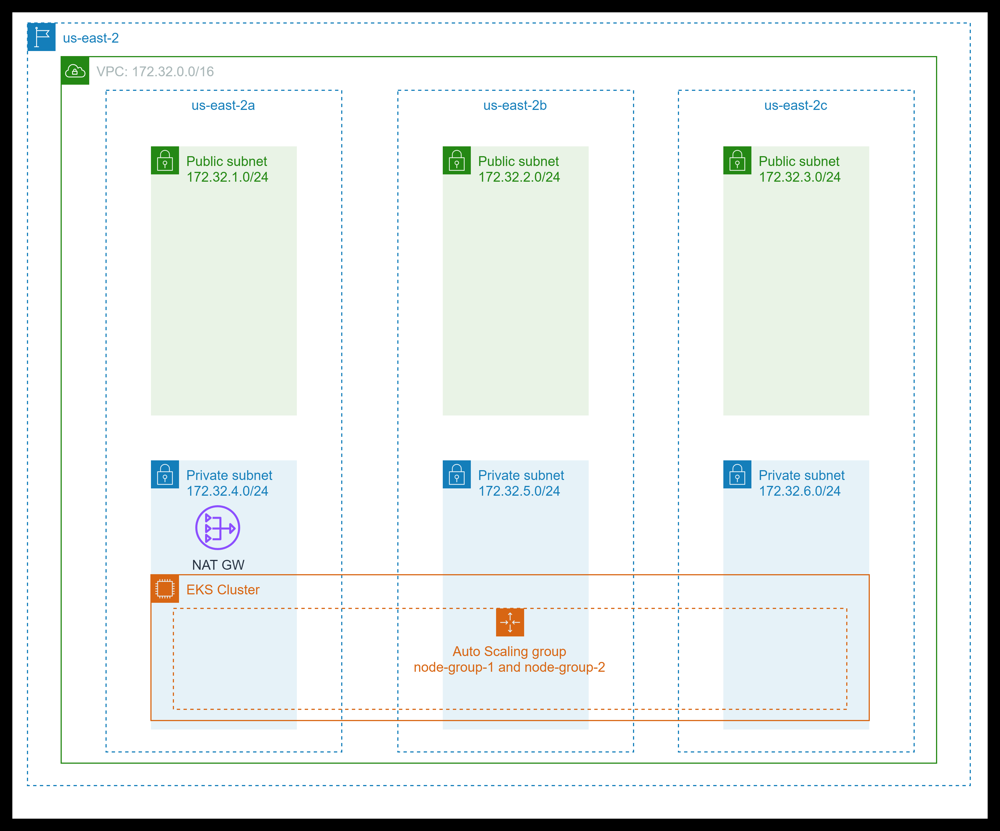

# EKS Terraform

## สำหรับเนื้อหาภาษาไทย

- https://nesutosan.medium.com/dae58350fb32

## Overall diagram



### Set up and initialize your Terraform workspace

1. Creat providers file `teraform.tf` to use in this project.

```terraform
terraform {
  // import provider
  // doc: https://developer.hashicorp.com/terraform/language/providers/requirements
  required_providers {
    // doc: https://registry.terraform.io/providers/hashicorp/aws/latest/docs
    aws = {
      source  = "hashicorp/aws"
      version = "~> 5.7.0"
    }

    // doc: https://registry.terraform.io/providers/hashicorp/random/latest/docs
    random = {
      source  = "hashicorp/random"
      version = "~> 3.5.1"
    }

    // doc: https://registry.terraform.io/providers/hashicorp/tls/latest/docs
    tls = {
      source  = "hashicorp/tls"
      version = "~> 4.0.4"
    }
  }
  required_version = "~> 1.3"
}
```

2. Create `variables.tf` to keep variable in this file keep only `region` variable

```terraform
variable "region" {
  description = "AWS region"
  type        = string
  default     = "us-east-2"
}

```

3. Create `main.tf` file to declare tasks of this project. Can devide about task in these.

- Choose region

```terraform
// doc: https://registry.terraform.io/providers/hashicorp/aws/latest/docs
provider "aws" {
  region = var.region
}
```

- Filter out local zones by use data-source `aws_availability_zones`

```terraform
// Filter out local zones, which are not currently supported
// with managed node groups
// doc: https://registry.terraform.io/providers/hashicorp/aws/latest/docs/data-sources/availability_zones
data "aws_availability_zones" "available" {
  filter {
    name   = "opt-in-status"
    values = ["opt-in-not-required"]
  }
}
```

- Create cluster name in local with `Random` Provider

```terraform
// Create cluster name in local with Random Provider
resource "random_string" "suffix" {
  length  = 8
  special = false
}
// manage local resources
// doc: https://registry.terraform.io/providers/hashicorp/local/latest
locals {
  cluster_name = "nesutosan-eks-${random_string.suffix.result}"
}
```

- Create vpc with module `terraform-aws-modules/vpc/aws`

```terraform
// Use module terraform-aws-modules/vpc/aws to configure vpc
// doc: https://github.com/terraform-aws-modules/terraform-aws-vpc
module "vpc" {
  source  = "terraform-aws-modules/vpc/aws"
  version = "5.0.0"

  name = "eks-vpc"

  // The IPv4 CIDR block for the VPC.
  cidr = "172.32.0.0/16"
  // A list of availability zones names or ids in the region
  azs  = slice(data.aws_availability_zones.available.names, 0, 3)

  private_subnets = ["172.32.1.0/24", "172.32.2.0/24", "172.32.3.0/24"]
  public_subnets  = ["172.32.4.0/24", "172.32.5.0/24", "172.32.6.0/24"]

  // Provision NAT Gateways for each of your private networks.
  enable_nat_gateway   = true
  // Provision a single shared NAT Gateway across all of your private networks.
  single_nat_gateway   = true
  one_nat_gateway_per_az = false
  // Enable DNS hostnames in the VPC.
  enable_dns_hostnames = true

  // Additional tags for the public subnets.
  public_subnet_tags = {
    "kubernetes.io/cluster/${local.cluster_name}" = "shared"
    "kubernetes.io/role/elb"                      = 1
  }

  // Additional tags for the private subnets.
  private_subnet_tags = {
    "kubernetes.io/cluster/${local.cluster_name}" = "shared"
    "kubernetes.io/role/internal-elb"             = 1
  }
}
```

- Create EKS cluster with `terraform-aws-modules/eks/aws` module

```terraform
// Use module terraform-aws-modules/eks/aws
// doc: https://github.com/terraform-aws-modules/terraform-aws-eks
module "eks" {
  source  = "terraform-aws-modules/eks/aws"
  version = "19.15.3"

  cluster_name    = local.cluster_name
  cluster_version = "1.27"

  // get vpc_id, private_subnets from output of vpc module
  vpc_id                         = module.vpc.vpc_id
  subnet_ids                     = module.vpc.private_subnets

  // Indicates the Amazon EKS public API server endpoint is enabled
  cluster_endpoint_public_access = true

  // Map of EKS managed node group default configurations
  eks_managed_node_group_defaults = {
    // Amazon Linux 2 (x86-64)
    // doc: https://docs.aws.amazon.com/cdk/api/v2/python/aws_cdk.aws_eks/NodegroupAmiType.html
    ami_type = "AL2_x86_64"
  }

  // Map of EKS managed node group definitions to create
  eks_managed_node_groups = {
    one = {
      name = "node-group-1"
      // for test only
      instance_types = ["t3.small"]

      min_size     = 1
      max_size     = 3
      desired_size = 2
    }

    two = {
      name = "node-group-2"
      // for test only
      instance_types = ["t3.small"]

      min_size     = 1
      max_size     = 2
      desired_size = 1
    }
  }
}
```

- Fetch information about a specific IAM policy with data source `aws_iam_policy`

```terraform
data "aws_iam_policy" "ebs_csi_policy" {
  arn = "arn:aws:iam::aws:policy/service-role/AmazonEBSCSIDriverPolicy"
}
```

- Creates single IAM role which can be assumed by trusted resources using OpenID Connect Federated Users.

```terraform
// aws-ebs-csi-driver submodules of module fully-loaded-eks-cluster
/* docs: [https://registry.terraform.io/modules/bootlabstech/fully-loaded-eks-cluster/aws/latest/submodules/aws-ebs-csi-driver,
https://github.com/bootlabstech/terraform-aws-fully-loaded-eks-cluster/tree/v1.0.7/modules/kubernetes-addons/aws-ebs-csi-driver] */
// Creates single IAM role which can be assumed by trusted resources using OpenID Connect Federated Users.
module "irsa-ebs-csi" {
  source  = "terraform-aws-modules/iam/aws//modules/iam-assumable-role-with-oidc"
  version = "4.7.0"

  create_role                   = true
  role_name                     = "AmazonEKSTFEBSCSIRole-${module.eks.cluster_name}"
  provider_url                  = module.eks.oidc_provider
  role_policy_arns              = [data.aws_iam_policy.ebs_csi_policy.arn]
  oidc_fully_qualified_subjects = ["system:serviceaccount:kube-system:ebs-csi-controller-sa"]
}
```

- Attaching persistent storage to an EKS cluster by using `aws-ebs-csi-driver`. The EBS CSI driver provides a CSI interface used by container orchestrators to manage the lifecycle of Amazon EBS volumes.

```terraform
// Resource: aws_eks_addon
// doc: https://registry.terraform.io/providers/hashicorp/aws/latest/docs/resources/eks_addon
// Attaching persistent storage to an EKS cluster by using aws-ebs-csi-driver.
resource "aws_eks_addon" "ebs-csi" {
  cluster_name             = module.eks.cluster_name
  addon_name               = "aws-ebs-csi-driver"
  addon_version            = "v1.20.0-eksbuild.1"
  service_account_role_arn = module.irsa-ebs-csi.iam_role_arn
  tags = {
    "eks_addon" = "ebs-csi"
    "terraform" = "true"
  }
}
```

- Finally `main.tf` file should be like this.

```terraform
// doc: https://registry.terraform.io/providers/hashicorp/aws/latest/docs
provider "aws" {
  region = var.region
}

// Filter out local zones, which are not currently supported
// with managed node groups
// doc: https://registry.terraform.io/providers/hashicorp/aws/latest/docs/data-sources/availability_zones
data "aws_availability_zones" "available" {
  filter {
    name   = "opt-in-status"
    values = ["opt-in-not-required"]
  }
}

// Create cluster name in local with Random Provider
resource "random_string" "suffix" {
  length  = 8
  special = false
}
// manage local resources
// doc: https://registry.terraform.io/providers/hashicorp/local/latest
locals {
  cluster_name = "nesutosan-eks-${random_string.suffix.result}"
}


// Use module terraform-aws-modules/vpc/aws to configure vpc
// doc: https://github.com/terraform-aws-modules/terraform-aws-vpc
module "vpc" {
  source  = "terraform-aws-modules/vpc/aws"
  version = "5.0.0"

  name = "eks-vpc"

  // The IPv4 CIDR block for the VPC.
  cidr = "172.32.0.0/16"
  // A list of availability zones names or ids in the region
  azs  = slice(data.aws_availability_zones.available.names, 0, 3)

  private_subnets = ["172.32.1.0/24", "172.32.2.0/24", "172.32.3.0/24"]
  public_subnets  = ["172.32.4.0/24", "172.32.5.0/24", "172.32.6.0/24"]

  // Provision NAT Gateways for each of your private networks.
  enable_nat_gateway   = true
  // Provision a single shared NAT Gateway across all of your private networks.
  single_nat_gateway   = true
  one_nat_gateway_per_az = false
  // Enable DNS hostnames in the VPC.
  enable_dns_hostnames = true

  // Additional tags for the public subnets.
  public_subnet_tags = {
    "kubernetes.io/cluster/${local.cluster_name}" = "shared"
    "kubernetes.io/role/elb"                      = 1
  }

  // Additional tags for the private subnets.
  private_subnet_tags = {
    "kubernetes.io/cluster/${local.cluster_name}" = "shared"
    "kubernetes.io/role/internal-elb"             = 1
  }
}

// Use module terraform-aws-modules/eks/aws
// doc: https://github.com/terraform-aws-modules/terraform-aws-eks
module "eks" {
  source  = "terraform-aws-modules/eks/aws"
  version = "19.15.3"

  cluster_name    = local.cluster_name
  cluster_version = "1.27"

  // get vpc_id, private_subnets from output of vpc module
  vpc_id                         = module.vpc.vpc_id
  subnet_ids                     = module.vpc.private_subnets

  // Indicates the Amazon EKS public API server endpoint is enabled
  cluster_endpoint_public_access = true

  // Map of EKS managed node group default configurations
  eks_managed_node_group_defaults = {
    // Amazon Linux 2 (x86-64)
    // doc: https://docs.aws.amazon.com/cdk/api/v2/python/aws_cdk.aws_eks/NodegroupAmiType.html
    ami_type = "AL2_x86_64"
  }

  // Map of EKS managed node group definitions to create
  eks_managed_node_groups = {
    one = {
      name = "node-group-1"
      // for test only
      instance_types = ["t3.small"]

      min_size     = 1
      max_size     = 3
      desired_size = 2
    }

    two = {
      name = "node-group-2"
      // for test only
      instance_types = ["t3.small"]

      min_size     = 1
      max_size     = 2
      desired_size = 1
    }
  }
}


// https://aws.amazon.com/blogs/containers/amazon-ebs-csi-driver-is-now-generally-available-in-amazon-eks-add-ons/
// doc: https://registry.terraform.io/providers/hashicorp/aws/latest/docs/data-sources/iam_policy
data "aws_iam_policy" "ebs_csi_policy" {
  arn = "arn:aws:iam::aws:policy/service-role/AmazonEBSCSIDriverPolicy"
}

// aws-ebs-csi-driver submodules of module fully-loaded-eks-cluster
/* docs: [https://registry.terraform.io/modules/bootlabstech/fully-loaded-eks-cluster/aws/latest/submodules/aws-ebs-csi-driver,
https://github.com/bootlabstech/terraform-aws-fully-loaded-eks-cluster/tree/v1.0.7/modules/kubernetes-addons/aws-ebs-csi-driver] */
// Creates single IAM role which can be assumed by trusted resources using OpenID Connect Federated Users.
module "irsa-ebs-csi" {
  source  = "terraform-aws-modules/iam/aws//modules/iam-assumable-role-with-oidc"
  version = "4.7.0"

  create_role                   = true
  role_name                     = "AmazonEKSTFEBSCSIRole-${module.eks.cluster_name}"
  provider_url                  = module.eks.oidc_provider
  role_policy_arns              = [data.aws_iam_policy.ebs_csi_policy.arn]
  oidc_fully_qualified_subjects = ["system:serviceaccount:kube-system:ebs-csi-controller-sa"]
}

// Resource: aws_eks_addon
// doc: https://registry.terraform.io/providers/hashicorp/aws/latest/docs/resources/eks_addon
// Attaching persistent storage to an EKS cluster by using aws-ebs-csi-driver.
resource "aws_eks_addon" "ebs-csi" {
  cluster_name             = module.eks.cluster_name
  addon_name               = "aws-ebs-csi-driver"
  addon_version            = "v1.20.0-eksbuild.1"
  service_account_role_arn = module.irsa-ebs-csi.iam_role_arn
  tags = {
    "eks_addon" = "ebs-csi"
    "terraform" = "true"
  }
}

```

4. Create the last (but not least) `output.tf` file.

```terraform
output "cluster_endpoint" {
  description = "Endpoint for EKS control plane"
  value       = module.eks.cluster_endpoint
}

output "cluster_security_group_id" {
  description = "Security group ids attached to the cluster control plane"
  value       = module.eks.cluster_security_group_id
}

output "region" {
  description = "AWS region"
  value       = var.region
}

output "cluster_name" {
  description = "Kubernetes Cluster Name"
  value       = module.eks.cluster_name
}
```

### Provision the EKS cluster

1. Initialize configuration

```bash
terraform init
```

2. Create a plan and export output plan to `tfplan` file

```bash
terraform plan -out "build.tfplan"
```

- To check plan can use this command

```bash
terraform show "build.tfplan"
```

3. Create plan to clean up infrastructure

```bash
terraform plan -destroy -out "destroy.tfplan"
```

4. Apply a saved plan

```bash
terraform apply "build.tfplan"
```

- For more information please visit [official page](https://developer.hashicorp.com/terraform/tutorials/cli/plan).

### Configure kubectl

1. Retrieve the access credentials for your cluster and configure

```bash
aws eks --region $(terraform output -raw region) update-kubeconfig --name $(terraform output -raw cluster_name)
```

2. Verify the Cluster

- get nodes

```bash
kubectl get nodes
```

- get cluster-info

```bash
kubectl cluster-info
```

### Clean up your workspace

- Destroy the resources you created in this tutorial to avoid incurring extra charges.

```bash
terraform apply "destroy.tfplan"
```

## Sources

- https://developer.hashicorp.com/terraform/tutorials/kubernetes/eks
- https://blog.devops.dev/how-to-provision-your-eks-cluster-using-terraform-7b086f9a9848
